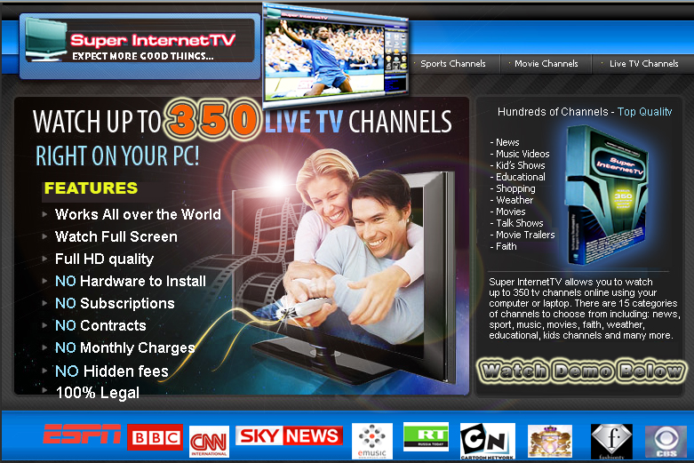



## Super InternetTV

### Description

Super InternetTV allows you to watch 350 TV channels online using your computer or laptop. There are 15 categories of channels to choose from including: news, sport, music, movies, faith, weather, educational, kids channels and many more. No extra hardware needed No monthly costs No hidden fees Yours for ever - Enjoy
 
### More Info
 

             |
---                |---
**Submitted On**   |2009-07-27 03:18:52
**By**             |[bongani khums](https://github.com/Planet-Source-Code/PSCIndex/blob/master/ByAuthor/bongani-khums.md)
**Level**          |Advanced
**User Rating**    |3.6 (18 globes from 5 users)
**Compatibility**  |VB 5\.0, VB 6\.0
**Category**       |[Internet/ HTML](https://github.com/Planet-Source-Code/PSCIndex/blob/master/ByCategory/internet-html__1-34.md)
**World**          |[Visual Basic](https://github.com/Planet-Source-Code/PSCIndex/blob/master/ByWorld/visual-basic.md)
**Archive File**   |[Super\_Inte2158537272009\.zip](https://github.com/Planet-Source-Code/bongani-khums-super-internettv__1-72308/archive/master.zip)

